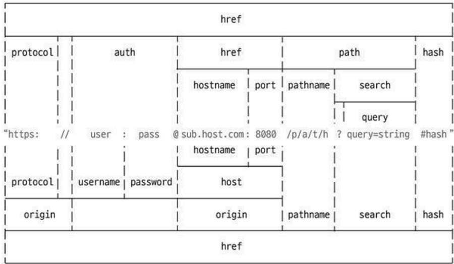

# 섹션 2. 노드기능 

## 1. REPL와 js 파일 실행하기	08:05	
### 자바스크립트는 스크립트라서 즉석에서 코드를 실행할 수 있음
  * REPL이라는 콘솔 제공
  * R(Read), E(Evaluate), P(Print), L(Loop)
  * 윈도에서는 명령 프롬프트, 맥이나 리눅수에서는 터미널에 node 입력 
### js파일을 만들어서 실행하기 
**ctrl+`** : vscode에서 terminal 창이 나옴 

----------------------------------

## 2. 모듈 만들기				11:07	
### 모듈 
* 노드는 자바스크립트 코드를 모듈로 만들 수 있음
  - `모듈` : 특정한 기능을 하는 함수나 변수들의 집합
  - 모듈로 만들면 여러 프로그램에서 재사용 가능 
### 모듈 만들어보기 
* 같은 폴더 내에 var.js, func.js, index.js 만들기
  - 한 파일이 100줄 이상 되는 경우 가독성이 떨어지다 보니 .. 
  - 파일 끝에 `module.exports`로 모듈로 만들 값을 지정/ `파일에서 한번만 쓸 수 있음 `
  - 다른 파일에서 `require(파일경로)`로 그 모듈의 내용을 가져올 수 있음.

> var.js 
```javascript
  const odd = '홀수입니다';
  const even = '짝수입니다.';

  module.exports = {
    odd, 
    even, 
  }; // 객체를 넘김 
````

>func.js
```javascript
const {odd, even} = require('./var');
function checkOddorEven(num){
  if(num%2){
    return add; 
  }
  return even; 
}
module.exports = checkOddorEven; 
````

>index.js
```javascript 
  const {odd, even} = require('./var');
  const checkNumber = require('./func');

  ..... 
````
* 자바스크립트 자체 모듈 시스템 문법이 생김(es2015모듈)
  * 아직 노드에서의 지원은 완벽하지 않음. (2020년 당시.. 현재는?)
  * mjs 확장자를 사용해야 함. 
  * 크게는 require대신 import, module.exports대신 export default를 쓰는 것으로 바뀜 
------------------------------
# 노드 내장 객체 

## 3. global과 콘솔, 타이머 (노드내장객체)	13:11	
### global
노드의 전역 객체 
  * 브라우저의 window같은 역할
  * 모든 파일에서 접근가능
  * window처럼 생략도 가능(console, require도 global속성)
  * `globalThis`는 브라우저에서도 통용 

### console객체 
터미널을 console이라고 생각하면 됨/
브라우저의 console객체와 매우 유사
* console.`dir`({hello:'hello'}) : 객체를 로깅
* console.time('hi') ~ console.timeEnd('hi') : 코드가 효율적인지 확인하기 위해 
* console.log : 평범한 로그 
* console.trace : 호출스택 로깅 
* console.table : 테이블 처럼 보임 

### 타이머 메서드 
* set 메서드에 clear 메서드가 대응됨 
  * set메서드의 리턴값(id)을 clear 메서드에 넣어서 취소
  * `setTimeout`(콜백함수, 밀리초) : 주어진 밀리초(1000분의 1초) 이후 콜백함수를 실행합니다. 
  * `setInterval`(콜백함수, 밀리초) : 주어진 밀리초마다 콜백함수를 반복 실행합니다. 
    - 변수에 담아줌 
  * `setImmediate`(콜백함수) : 콜백함수를 즉시 실행합니다. 
    - setTimeout(콜백, 0)보다 setImmediate 권장 
  * clearTimeout(아이디) : setTimeout을 취소합니다.
  * clearInterval(아이디) : setInterval을 취소합니다.
  * clearImmediate(아이디) : setImmediate을 취소합니다.

------------------------------
## 4. exports와 this		08:52	
> 노드는 브라우저와 달리 사용자의 컴퓨터 디스크에 접근이 가능함. 

> 그래서 노드로 자바스크립트 실행할 때에는 주의가 필요. 해커가 심어놓은 js를 실행하게 된다면 소중한 하드디스크가 모두 털릴 수 있음 

> 파일시스템 접근에 보안적인 허점이 있으므로 주의 필요. 
### __filename
- 현재 파일 경로
### __dirname 
- 현재 폴더(디렉토리 경로)

### module, exports
- module.exports 외에도 exports로 모듈만들수 있음 
  * 모듈 예제의 var.js를 다음과 같이 바꾼 후 실행 
  * 동일하게 동작함 
  * 동일한 이유는 module.exports와 exports가 참조관계이기 때문 / **같이쓸 수는 없음** 
  * exports에 객체 속성이 아닌 다른 값을 대입하면 참조관계가 깨짐

```javascript
  exports.add = '홀수입니다';
  exports.even = '짝수입니다';
  // module.exports = {odd, even};과 동일 
  // 차이는?
````


### this 
* 노드에서 this를 사용할 때 주의점이 있음 
  * 최상위 스코프의 `this`는 `module.exports`를 가리킴
  * 그 외에는 브라우저의 자바스크립트와 동일
  * `함수내부의 this`는 `global`(전역)객체를 가리킴 
  > 차이점 : js에서는 this는 전역객체(window)를 가리킴
  * 함수의 this는 함수마다 생기는것 동일 
  * 화살표 함수의 this는 부모를 물려받는 것도 동일

------------------------------
## 5. 모듈 심화, 순환 참조		10:13	
### require의 특성 
* 몇가지 알아둘만한 속성이 있음
  * require가 제일 위에 올 필요는 없음 
    > 비교 : import는 가장 위에 있어야함 
  * require.cache에 한번 require한 모듈에 대한 캐슁정보가 들어 있음
  * require.main은 노드 실행 시 첫 모듈을 가리킴.

### 순환참조 
* 두개의 모듈이 서로를 require하는 상황을 조심해야 함.
  * Dep1이 dep2를 require하고, dep2가 dep1을 require 함. 
  * Dep1의 module.exports가 함수가 아니라 빈객체가 됨 (무한 반복을 막기 위해 의도됨)
  * 순환참조하는 상황이 나오지 않도록 하는 것이 좋음. (노드에서 막아주긴 하지만...)
------------------------------
## 6. process				08:27	 
## * PROCESS 
* 현재 실행중인 노드 프로세스에 대한 정보를 담고 있음.
  * 컴퓨터마다 출력값이 다를 수 있음 
```
$ node 
> process.version  // 설치된 노드 버전 
> process.arch // 프로세스 아키텍처 정보
> process.platform // 운영체제 플랫폼 정보. linux, darwin, freebsd등의 값일 수 있음 
> process.pid // 현재 프로세스 아이디. 프로세스를 여러개 가질 때 구분할 수 있음 
> process.uptime() // 프로세스가 시작한 후 흐른 시간. 단위는 '초'. ex> 5분 후에 자동으로 꺼지게...할 수 있음 
> process.execPath // 노드의 경로 
> process.cwd() // 현재 프로세스가 실행되는 위치 
> process.cpuUsage() // 현재 cpu 사용량
``` 

노드실행경로를 아는 방법
> __filename, __dirname, process.cwd()
>  * 참고 : __ double underscore : 던더스코어 라고 부름 

## * process.env
#### [시스템 환경 변수]들이 들어 있는 객체 
* 비밀키(데이터베이스 비밀번호, 서드파티 앱 키 등)를 보관하는 용도로 쓰임 
* 환경변수는 process.env로 접근 가능 
 
```javascript
const secretID = process.env.SECRET_ID; 
const secretCode = process.env.SECRET_CODE; 
```
* 일부 환경변수는 노드 실행시 영향을 미침
* 예시) NODE_OPTIONS(노드실행 옵션), UV_THREADPOOL_SIZE(스레드풀 개수)
  * max-old-space-size는 노드가 사용할 수 있는 메모리를 지정하는 옵션 

  ```ini
  NODE_OPTIONS=--max-old-space-size=8192 
  UV_THREADPOOL_SIZE=8
  ```

### * process.nextTick(콜백)
- 이벤트 루프가 다른 콜백 함수보다 nextTick의 콜백함수를 우선적으로 처리함 
  * 너무 남용하면 다른 콜백함수들 실행이 늦어짐
  * 비슷한 경우로 promise가 있음(nextTick처럼 우선순위가 높음)
  * 아래 예제에서 setImmediate, setTimeout보다 promise와 nextTick이 먼저 실행됨

> nextTick.js
* 4가지 모두 백그라운드로 넘어갔다가 태스크큐로 이동
 
 ```javascript
  setImmediate(()=>{
    console.log('즉시'); 
  }); 
  process.nextTick(()=>{
    console.log('nextTick');
  });
  setTimeout(()=>{
    console.log('타임아웃'); 
  }, 0); 
  Promise.resolve().then(()=>console.log('promise'));
 ```
> 실행결과 
* nextTick, promise는 microtask라 우선 실행됨 
* nextTick, promise 사이에서는 순서가 지켜짐
* setTimeout, setImmediate는 누가 먼저 실행될지 모름, 헛갈리니까 setTimeout, 0 쓰지 말고 setImmediate로 통일 
<pre>
$ node nextTick
nextTick
promise 
타이아웃
즉시
</pre>

### * process.exit(코드)
* 현재의 프로세스를 멈춤 
  * 코드가 없거나 0 이면 정상종료 
  * 이외의 코드는 비정상 종료를 의미함 
> 서버에서 에러가 발생한 경우 에러가 발생했다고 알리고 끄기 위해서 `process.exit(1)`이라고 종종 함 

------------------------------
# 노드 내장 모듈 
## 7. os와 path 			12:15	
* process와 겹치는 부분이 있음 
## os
```javascript 
-- 운영체제 정보 
os.arch();  // process.arch와 동일
os.platform();  // process와 동일
os.type();  // 운영체제 종류 보여줌
os.uptime();  // 운영체제 부팅이후 흐른 시간(초)
os.hostname(); // 컴퓨터의 이름
os.release(); // 운영체제의 버전 

-- 경로 
os.homedir(); //홈 디렉토리의 경로
os.tmpdir(); // 임시 파일 저장 경로 

-- cpu정보 
os.cpus(); // 중요 - 컴퓨터의 코어 정보 보여줌 
os.cpus().length;  

-- 메모리 정보
os.freemem(); // 사용가능한 메모리(RAM)을 보여줌
os.totalmem(); // 전체 메모리 용량을 보여줌 
````
* `os.cpus()`가 많이 사용 
  - node는 싱글 쓰레드이기 때문에.. 
  - 효율적인 코어 활용을 위해서 OS에서 가용할 수 있는 코어 수를 찾기 위함 
> PC에서 말하는 core와 node에서 말하는 것이 다름 
> 8 core 16 thread라는 컴퓨터 16 core라고 생각하면 됨

## path 
폴더와 파일의 경로를 쉽게 조작하도록 도와주는 모듈
  * 운영체제별로 경로 구분자가 다름 (window: '\', POSIX: '/')

```javascript 
const path = require('path'); 
const string = __filename ;  // 경로 

path.sep ; // 구분자 
path.deleimiter ; // 환경변수 구분자 
path.dirname(string); //파일이 위치한 폴더 경로
path.extname(string); // 파일의 확장자
path.basename(string);// 파일의 이름(확장자 포함)을 보여줌.
path.basename(string, path.extname(string)); // 파일의 이름만 표시하고 싶다면.. 
path.parse(string); //파일경로를 root, dir, base, ext, name으로 분리 
path.format({  // 다시 합침
  dir:'c:\\users', 
  name :'path', 
  ext : '.js', 
}); 
path.normalize('c://users\\path.js') // /, \를 실수로 혼용하는 경우 정상경로로 변환
path.isAbsoluter('c:\\'); // true/false 
path.isAbsoluter('./home');

path.relative('c:\\users\\path.js', 'c:\\'); // a->b로 가는 방법을 알려줌 
path.join(__dirname, '..', '..', '/users'); //주소합침/ 절대경로 나오며 무시 
path.resolve(경로...): path.join()과 비슷. 절대경로가 나오면 절대경로를 우선으로 보여줌
````
* path.delimiter : 환경변수 구분자. process.env.PATH를 입력하면 여러개의 경로가 이 구분자로 구분되어 있습니다. window는 세미콜론(;), POSIX는 콜론(:)입니다. 
* `join`과 `resolve`의 차이 : resolve는 /를 절대경로로 처리, join은 상대경로로 처리 
  * 상대경로 : 현재 파일 기준, 같은 경로면 점하나(.), 한단계 상위 경로면 점 두개(..)
  * 절대 경로는 루트 폴더나 노드 프로세스가 실행되는 위치가 기준 
* \\와 \의 차이 : \는 윈도 경로 구분자, \\는 자바스크립트 문자열 안에서 사용 (\가 특수문자라 \\라 이스케이프 해준 것 )  
* 윈도에서 POSIX path를 쓰고 싶다면 path:posix 객체 사용 
  * POSIX에서 윈도 path를 쓰고 싶다면 : path.win32객체 사용 
------------------------------
## 8. url과 querystring 05:24 

## * url 모듈
* 인터넷 주소를 쉽게 조작하도록 도와주는 모듈
  * url처리에 크게 두가지 방식이 있음( 기존 노드 방식 vs WHATWG 방식)
  * 아래 그림처럼 가운데 주소를 기준으로 위쪽을 기존 노드방식, 아래쪽은 WHATWG방식 




```javascript 
const url = require('url'); ----- ①
````

 ① url 모듈 안에 URL생성자가 있음. 이 생성자에 주소를 넣어 객체로 만들면 주소가 부분별로 정리됨. 이 방식이 WHATWG의 url임. 
 WHATWG에만 있는 username, password, origin, searchParam 속성이 존재. 

* 기존 노드 방식 메서드 
  * url.parse(주소) : 주소를 분해. WHATWG방식과 비교하면 username, password대신 auth 속성이 있고, searchParams대신 query가 있음
  * url.format(객체) : WHATWG방식의 url과 기존 노드의 url 모두 사용할 수 있음. 분해되었던 url객체를 다시 원래 상태로 조립합니다. 

> WHATWG와 기존방식이 공존하는 이유

> https://www.naver.com/login   
/login 이라고만 넘어오는 경우가 있는 데 이런경우는    
WHATWG 방식으로 구분하기 어려움으로 기존 방식을 사용해야 함. 

## * searchParams 
* **WHATWG 방식**에서 쿼리스트링(search)부분 처리를 도와주는 객체 (주소데 데이터를 담는 방법)
  * ?page=3&limit=10&category=nodejs&category=javascript 부분 
  * 문자열이라 처리가 복잡해서 `객체`로 바꿔주는 것 -> searchParams 

  * **getAll(키)** : 키에 해당하는 모든 값들을 가져옵니다. 
  * **get(키)** : 키에 해당하는 `첫번째 값`만 가져옵니다. 
  * **has(키)** : 해당 키가 있는지 없는지를 검사합니다. 
  * **keys() **: searchParams의 모든 키를 반봅기(iterator, ES2015문법) 객체로 가져옵니다.
  * **values()** : searchParams의 모든 값을 반복기 객체로 가져옵니다. 
  * **append(키, 값)** : 해당 키를 추가합니다. 같은 키의 값이 있다면 유지하고 하나 더 추가합니다. 
  * **set(키, 값)** : append와 비슷하지만 같은 키의 값들을 모두 지우고 새로 추가합니다. 
  * **delete(키)** : 해당 키를 제거합니다. 
  * **toString()**: 조작한 searchParams 객체를 다시 문자열로 만듭니다. 이 문자열을 search에 대입하면 주소 객체에 반영됩니다. 
* **기존 노드 방식**에서는 url querystring을 querystring 모듈로 처리 
  * querystring.parse(쿼리) : url의 query부분을 자바스크립트 객체로 분해해줌
  * querystring.stringify(객체) : 분해된 query 객체를 문자열로 다시 조립해줌. 
------------------------------
## 9. crypto와 util		17:36	
* 암호화 - 멀티쓰레드 
### 단방향 암호화(crypto)
* 암호화는 가능하지만 복호화는 불가능
  * 암호화 : 평문을 암호로 만듬
  * 복호화 : 암호를 평문으로 해독 

* 단방향 암호화의 대표 주자는 `해시`기법 
  * 문자열을 고정된 길이의 다른 문자열로 바꾸는 방식
  * abcdefgh 문자열 -> qvew
  * 항상 같은 문자열임. 
  * `매우안전` 
* Hash 사용하기(SHA512)
  * createHash(알고리즘) : 사용할 해시 알고리즘을 넣어줍니다. 
    + md5, sha1, `sha256`, `sha512` 등이 가능하지만, md5와 sha1은 이미 취약점이 발견
    + 현재는 `sha512`  정도로 충분하지만 나중에 sha512마저도 취약해지면 더 강화된 알고리즘으로 바꿔야 합니다.
* update(문자열) : 변환할 문자열을 넣어줍니다. 
* digest(인코딩) : 인코딩할 알고리즘을 넣어줍니다. 
  * base64, hex, latin1이 주로 사용되는데 그중 base64가 결과 문자열이 가장 짧아 애용됩니다. 결과물로 변환된 문자열을 반환합니다.   

### pbkdf2 
#### 컴퓨터의 발달로 기존 암호화 알고리즘이 위협받고 있음
  * sha512가 취약해지면 sha3으로 넘어가야 함. 
  * 현재는 `pbkdf2`나 `bcrypt`, `scrypt`알고리즘으로 비밀번호를 암호화 
  * 노드는 pbkdf2와 scrypt지원 
  * crypto.randomBytes로 64바이드 문자열 생성 -> salt 역할
  * pbkdf2 인수를 순서대로 비밀번호, salt, 반복횟수, 출력바이트, 알고리즘 
  * 반복횟수를 조정해 암호화하는데 1초 정도 걸리게 맞추는 것이 권장됨.

### 양방향 암호화 
#### 대칭형 암호화(암호문 복호화 가능)
* Key가 사용됨
* 암호화할 때와 복호화할 때 같은 Key를 사용해야 함.
```javascript
const crypto = require('crypto');

const algorithm = 'aes-256-cbc';
const key = 'abcdefghsdf1234';
const iv = '123456789123456789';

const cipher = crypto.createCipheriv(algorithm, key, iv); 
let result = cipher.update('암호화할 문장', 'utf8', 'base64');
result += cipher.final('base64'); 
console.log('암호화:', result);
````
> 생각보다 보안에 취약 : 해커들이 key를 훔치려고 하고, 훔칠 가능성이 높음    
> front와 server관계(한쪽이 공개적인 경우)에서는 사용할 수 없음 (key를 개발자 도구에서 다 보임)   
> createCipher`iv` : 취약점땜에 iv 추가   
>  > crypto.js 활용이 비교적 쉬움


### 양방향 암호화 메서드 
* crypto.createCipheriv(알고리즘, 키, iv): 암호화 알고리즘과 키, 초기화벡터를 넣어줍니다. 
  * 암호화 알고리즘은 aes-256-cbc를 사용했습니다. 다른 알고리즘을 사용해도 됩니다. 
  * 사용 가능한 알고리즘 목록은 crypto.getCiphers()를 하면 볼 수 있습니다. 
  * 키는 32바이트, 초기화벡터(iv)는 16바이트로 고정입니다. 

* cipher.update(문자열, 인코딩, 출력인코딩) : 암호화할 대상과 인코딩, 출력 결과물의 인코딩을 넣어줍니다. 
  * 보통 문자열은 utf8인코딩을 암호는 base64를 많이 사용합니다. 

* cipher.final(출력인코딩): 출력 결과물의 인코딩을 넣어주면 암호화가 완료됩니다. 
* cypto.createDecipheriv(알고리즘, 키, iv): 복호화할 때 사용합니다. 암호화할 때 사용했던 알고리즘과 키, iv를 그대로 넣어주어야 합니다. 
* decipher.update(문자열, 인코딩, 출력인코딩 ): 암호화된 문장, 그 문장의 인코딩, 복호화할 인코딩을 넣어줍니다. 
  * createChpher의 update()에서 utf8, base64 순으로 넣었다면 createDecipher의 update()에서는 base64, utf8 순으로 넣으면 됩니다. 
* decipher.final(출력 인코딩):복호화 결과물의 인코딩을 넣어줍니다. 

> 현업에서는 비밀번호, salt, key, .env등은 GIT에 올려서는 안됨   
> AWS KMS (KEY MANAGEMENT SERVICE)이용하기도 함   
> 대부분 사람실수(console, log)로 해킹되는 것임 

## util 
* 각종 편의 기능을 모아둔 모듈 
  * deprecated와 promisify가 자주 쓰임 

* util.deprecate : 함수가 deprecated처리되었음을 알려줍니다. 
  * 첫번째 인자로 넣은 함수를 사용했을 때 경고 메시지가 출력됩니다. 
  * 두번째 인자로 경고 메시지 내용을 넣으면 됩니다. 함수가 조만간 사라지거나 변경될 때 알려줄 수 있어서 유용합니다. 
* util.promisify : 콜백 패턴을 프로미스 패턴으로 바꿔줍니다 
  * 바꿀 함수를 인자로 제공하면 됩니다. 이렇게 바꾸어두면 async/await 패턴까지 사용할 수 있어 좋습니다. 단, 콜백이 `(error, data)=>{}*`형식이어야 합니다. 
  * randomByte와 비교해보세요. 프로미스를 콜백으로 바꾸는 util.callbackify도 있지만 자주 사용하지는 않습니다. 

> ### **deprecated 이란?**   
> deprecated는 프로그래밍 용어로, '중요도가 떨어져 더 이상 사용되지 않고 앞으로는 사라지게 될' 것이라는 뜻입니다. 새로운 기능이 나와서 기존 기능보다 더 좋을 때, 기존 기능을 deprecated처리하곤 합니다. 이전 사용자를 위해 기능을 제거하지는 않지만 곧 없ㅇ엘 예정이므로 더이상 사용하지 말라는 의미입니다. 

------------------------------
## 10. worker_threads		20:22	
### 노드에서 멀티 스레드 방식으로 작업할 수 있음 
  * isMainThread : 현재 코드가 메인 스레드에서 실행되는지, 워커 스레드에서 실행되는지를 구분
  * 메인 스레드에서는 new Worker를 통해 현재 파일(__filename)을 워커 스레드에서 실행시킴
  * worker.postMessage로 부모에서 워커로 데이터를 보냄
  * parentPort.on('message')로 부모로부터 데이터를 받고, postMessage로 데이터를 보냄
* 예 : 2~10000000 소수 찾기 (복잡)
[소스](https://creamereos.github.io/dev/2020/12/02/dev-nodeJS-woker_thread/)
> 노드로 멀티스레드를 하기 보다 다른언어로 하는 것을 추천 
------------------------------
## 11. child_process		05:47 
* node안에서 프로그램을 하나 띄울 수 있음
* `child_process` : 노드에서 다른 프로그램을 실행하고 싶거나, 명령어를 수행하고 싶을 때 사용하는 모듈. 즉 다른언어의 코드를 실행하고 결과값을 받을 수 있다. 노드 프로세스 외에 새로운 프로세스(child_process)를 띄워서 명령을 수행하고 노드 프로세스에 결과를 알려준다. [소스](https://creamereos.github.io/dev/2020/12/04/dev-nodeJS-child-porcess/)

> ### **exec와 spawn차이점**   
> exec : 셀을 실행해서 명령어 수행.    
> spawn : 새로운 프로세스를 띄우면서 명령어 실행 (3번째 인수로 {shell:true}제공하면 exec처럼 셀 실행해서 명령어 수행)


* 기타모듈들 : 많이 쓰이지는 않음 
  * assert : 값을 비교하여 프로그램이 제대로 동작하는지 테스트하는데 사용
  * dns : 도메인 이름에 대한 ip주소를 얻어내는데 사용 
  * net : HTTP보다 로우레벨인 TCP나 IPC통신을 할 때 사용합니다. 
  * string_decoder : 버퍼 데이터를 문자열로 바꾸는 데 사용합니다. 
  * tls : TLS와 SSL에 관련된 작업을 할 때 사용합니다. 
  * tty: 터미널과 관련된 작업을 할 때 사용합니다. 
  * dgram : UDP와 관련된 작업을 할 때 사용합니다. 
  * v8 : V8 엔진에 직접 접근할 때 사용합니다. 
  * vm : 가상머신에 직접 접근할 때 사용합니다. 
------------------------------ 
## 12. 파일 시스템 사용하기		16:50	

### fs
* 파일 시스템에 접근하는 모듈
  * 파일/폴더 생성, 삭제, 읽기, 쓰기 가능
  * 웹 브라우저에서는 제한적이었으나 노드는 권한을 가지고 있음

```javascript 
const fs = require('fs').promises;
// 파일 읽기 
fs.readFile('./readme.txt')
      .then(()=>{
        console.log(data);
        console.log(data.toString()); 
      })
      .catch((err)=>{
        throw err; 
      });      

// 파일 쓰기 
fs.writeFile('./writeme.txt', '작성할 글' )
      .then(()=>{
        return fs.readFile('/writeme.txt')
      })
      .then((data)=>{
        // 프로미스 체인
        console.log(data.toString());
      })
      .catch((err)=>{
        throw err; 
      });      

````
### 동기 메서드와 비동기 메서드
* 예제를 여러 번 실행해보기 
  * 매번 순서가 다르게 실행됨 
  * 순서에 맞게 실행하려면? 

* 동기와 비동기 : 백그라운드 작업 완료 확인 여부 
* 블로킹가 논 블로킹 : 함수가 바로 return 되는지 여부 
* 노드에서는 대부분 `동기-블로킹` 방식과 `비동기-논블로킹` 방식임

> 동기적으로 파일을 읽으려면 
```javascript 
const fs = require('fs');
let data = fs.readFileSync('./readme.txt'); 
console.log('1번', data.toString()); 
// 서버 초기화 할 때나 필요하지
// 실제로 서버에서 사용하면 문제가 발생함 
```  

> 비동기로 하되 순서를 지키는 것 (추천)  
```javascript 
const fs = require('fs');

async function main() {
  let data = await fs.readFile('./readme.txt'); 
  console.log('1번', data.toString()); 
  data = await fs.readFile('./readme.txt'); 
  console.log('2번', data.toString()); 
  data = await fs.readFile('./readme.txt'); 
  console.log('3번', data.toString()); 
  data = await fs.readFile('./readme.txt'); 
  console.log('4번', data.toString()); 
}
main(); 
// 서버 초기화 할 때나 필요하지
```  
------------------------------
## 13. 버퍼와 스트림 이해하기		15:27	
### `버퍼` : 일정한 크기로 모아두는 데이터   
  * 일정한 크기가 되면 한 번에 처리
  * 버퍼링 : 버퍼에 데이터가 찰 때까지 모으는 작업 
  * 버퍼크기 = 파일크기랑 동일 
### `스트림` : 데이터의 흐름 (`효율`)
  * 일정한 크기로 나눠서 여러번에 걸쳐서 처리
  * 버퍼(또는 청크)의 크기를 작게 만들어서 주기적으로 데이터를 전달 
  * 스트리밍 : 일정한 크기의 데이터를 지속적으로 전달하는 작업 
```javascript 
const buffer = Buffer.from('저를 버퍼로');
console.log(buffer);

// 스트림으로 여러개의 버퍼를 받는 경우 
// 버퍼를 합치는 작업이 필요함 
const array = [Buffer.from('띄엄 '), Buffer.from('띄어쓰기')]; 
console.log(Buffer.concat(array).toString()); 
// 때때로 데이터는 없지만 버퍼를 미리 잡아둬야 하는 경우도 있다. 
console.log(Buffer.alloc(5));
```
> 파일을 읽을 때 스트림으로 읽으려면    
> 버퍼 방식에 비해 메모리를 절약할 수 있음. 
```javascript
const fs = require('fs');
// createReadStream 한번에 읽는 버퍼사이즈 64kb 
const readStream = fs.createReadStream('./readme.txt', {highWaterMark : 16 }); 

const data = [];
readStream.on('data', (chunk)=>{
  data.push(chunk); 
  console.log('data:', chunk, chunk.length);   
}); 

readStream.on('end', ()=>{
  console.log('end :', Buffer.concat(data).toString()); 
}); 

// stream도 비동기이기 때문에 error처리를 잘해야 
readStream.on('error' , (err)=>{
  console.log('error:', err);
}); 
```

> 글쓸 때 
```javascript
const fs = require('fs'); 

const writeStream = fs.createWriteStream('./write.txt');
writeStream.on('finish', ()=>{
  console.log('파일쓰기 완료');
}); 
writeStream.write('이 글을 씁니다\n');
writeStream.write('한 번 더 씁니다');
writeStream.end();
```
 
------------------------------
## 14. pipe와 스트림 메모리 효율 확인	15:32	

```javascript
const fs = require('fs');
const zlib = require('zlib'); 

const readStream = fs.createReadStream('./readme3.txt', {hgitWaterMark: 16}); 
const zlibStream = zlib.createGzip(); 
const writeStream = fs.createWriteStream('./writeme4.txt'); 
// 여러개의 PIPE를 연결해서 사용할 수 있음
readStream.pipe(zlibStream).pipe(writeStream); 
```

### 기타 fs 메서드 
* `fs.access`(경로, 옵션, 콜백) : 폴더나 파일에 접근할 수 있는지를 체크합니다. 두번째 인자로 상수들을 넣었습니다. F_OK는 파일 존재여부, R_OK는 읽기 권한여부, W_OK는 쓰기 권한 여부를 체크합니다. 파일/폴더나 권한이 없다면 에러가 발생하는데, 파일/폴더가 없을 때의 에러코드는 ENOENT입니다. 
* `fs.mkdir`(경로, 콜백) : 폴더를 만드는 메서드입니다. 이미 폴더가 있다면 에러가 발생하므로 먼저 access() 메서드를 호출해서 확인하는 것이 중요합니다. 
* `fs.open`(경로, 옵션, 콜백) : 파일의 아이디(fd변수)를 가지고 오는 메서드입니다. 파일이 없다면 파일을 생성한 뒤 그 아이디를 가져옵니다. 가져온 아이디를 사용해 fs.read()나 fs.write()로 읽거나 쓸수 있습니다. 두번째 인자로 어떤 동작을 할 것인지 설정할 수 있습니다. 쓰려면 w, 읽으려면 r, 기존 파일에 추가하려면 a입니다. 
* `fs.rename`(기존경로, 새경로, 콜백) : 파일의 이름을 바꾸는 메서드입니다. 기존파일의 위치와 새로운 파인 위치를 적어주면 됩니다. 반드시 같은 폴더를 지정할 필요가 없으며 잘라내기 같은 기능을 할 수도 있습니다. 

* `fs.readdir`(경로, 콜백) : 폴더안의 내용 확인. 배열안의 내부파일과 폴더명이 나옵니다. 
* `fs.unlink`(경로, 콜백) : 파일을 지울 수 있음. 파일이 없다면 에러가 발생하므로 먼저 파일이 있는지를 꼭 확인해야 합니다. 
* `fs.rmdir`(경로, 콜백) : 폴더를 지울 수 있습니다. 폴더안에 파일이 있다면 에러가 발생하므로 먼저 내부 파일을 모두 지우고 호출해야 합니다. 
* `fs.copyFile` : 파일 복사방법  
> createReadStream, createWriteStream복사할 수도 있음 => 장점 중간에 압축 pipe를 사용할 수 있음 
* `fs.watch`(대상파일, 콜백) : 파일을 감시하는 방법(변경사항 발생 시 이벤트 호출 )
* `fs.existsSync` : 존재여부 확인 
* `fs.stat` : 파일이 폴더인지, 바로가기인지... 등 알아낼 수 있음 

------------------------------
## 15. 스레드풀과 커스텀 이벤트		08:39	
fs, crypto, zlib모듈의 메서드를 실행할 때에는 백그라운드에서 동시에 실행됨 
  * 스레드풀이 동시에처리해줌. 
  * 노드에서는 동시에 4개씩  스레드풀 처리 
  ```
  SET UV_THREADPOOL_SIZE = 8 // 동시에 처리하는 스레드풀의 사이즈를 증가
  ```

------------------------------
## 16. 에러 처리하기			08:52
* 노드 - 싱글스레드 
### 예외(exception ) : 처리하지 못한 에러 
* 노드 스레드를 멈춤 
* 노드는 기본적으로 싱글 스레드라 스레드가 멈춘다는 것은 프로세스가 멈추는 것 
* 에러 처리는 필수 
  * 기본적으로 TRY catch문의 예외처리 
  * 에러가 발생할 만한 곳을 try catch로 감쌈
  * 노드 비동기 메서드의 에러는 따로 처리하지 않아도 됨. 
  * 콜백함수에서 에러 객체 제공
```javascript
 fs.unlink('./ddd.js', (err)=>{ // try catch안해도됨. 
   if(err){
     console.error(err); 
   }
 }); 
```
  * 프로미스의 에러는 따로 처리하지 않아도 됨. 
    * 버전이 올라가면 동작이 바뀔 수 있음 
  * 최후의 수단으로 사용 
    * 콜백함수의 동작이 보장되지 않음 
    * 따라서 복구 작업용으로 쓰는 것은 부적합
    * `에러내용 기록용`으로만 쓰는 것이 좋음

### 프로세스 (강제) 종료하기 
  * 윈도우 
```
$ netstat -ano | findstr 포트  //프로세스 아이디 찾기 
$ taskkill /pid 프로세스아이디 /f
```
  * 맥/리눅스 
```
$ lsof -i tcp:포트 
$ kill -9 프로세스아이디
```
